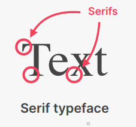
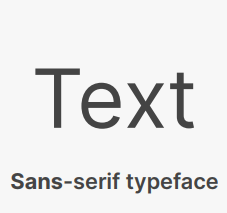

<!-- @format -->

# All Web Design Rules and Guidelines

---

## OVERVIEW

### WEB DESIGN VS DEVELOPMENT

> Web **Designer** create the overall **look and feel** of a website.\
> Web **Developer** implement the design using **HTML, CSS and JavaScript code**

The **designers** design a website or a webpage using design tools such as **Figma**, **AdobXD** and **Photoshop** etc. but **developer** take that design and implement it through **code**

### WHY TAKE DESIGN SERIOUSLY?

| GOOD DESIGN                                                                                                                  | BAD DESIGN                                                                          |
| ---------------------------------------------------------------------------------------------------------------------------- | ----------------------------------------------------------------------------------- |
| Creates an immediate and lasting **good impression** of the brand or product                                                 | Make users believe the brand **doesn't really care** about their product or service |
| Make the user **trust** the brand right away                                                                                 | Make the user **insecure** about trusting the brand                                 |
| Increases the user's **perceived value** of the brand or product                                                             | Make the brand or product seem **"cheap"**                                          |
| Gives users exactly **what they were looking for** when coming to the site, e.g. purchasing a product or finding information | Leaves users **confused**, and makes it **hard** to for them to reach their goal    |

### EVERYONE CAN LEARN GOOD DESIGN

Good Web desing is **not subjective or creative** everyone can learn basic by following some **rules and guidelines**

### ALL DESIGN INGREDIENTS

1. Typography
2. Colors
3. Images and Illustrations
4. Icons
5. Shadows
6. Border-radius
7. Whitespace
8. Visual Hierarchy
9. User Experience
10. Components and Layout

Design decisions for each igredient are based on **website personality**

### All Website Personalities

**Design ingredients need to be applied in different ways to different website personalities.** Different personalities have different traits, therefore choices for design ingredients need to be made accordingly.

1. **Serious/Elegant:** For luxury and elegance, based on thin serif typefaces, golden or pastel colors, and big high-quality images
2. **Minimalist/Simple:** Focusses on the essential text content, using small or medium-sized sans-serif black text, lines, and few images and icons
3. **Plain/Neutral:** Design that gets out of the way by using neutral and small typefaces, and a very structured layout. Common in big corporations
4. **Bold/Confident:** Makes an impact, by featuring big and bold typography,
   paired with confident use of big and bright colored blocks
5. **Calm/Peaceful:** For products and services that care, transmitted by
   calming pastel colors, soft serif headings, and matching images/illustrations
6. **Startup/Upbeat:** Widely used in startups, featuring medium-sized sansserif typefaces, light-grey text and backgrounds, and rounded elements
7. **Playful/Fun:** Colorful and round designs, fueled by creative elements like hand-drawn icons or illustrations, animations, and fun language

## \#1 TYPOGRAPHY

> **Typography** is the art and technique
> of arranging type to make written
> language **legible**, **readable** and **appealing**
> when displayed
>
> _\- Wikipedia_

### SARIF VS SANS-SARIF

| SARIF                                                                | SANS-SARIF                                                                |
| -------------------------------------------------------------------- | ------------------------------------------------------------------------- |
| All Web Design Rules and Guidelines                                  | Modern look and feel                                                      |
| Modern look and feel                                                 | Clean and simple                                                          |
| Clean and simple                                                     | Easier to choose for beginner designer                                    |
|                         |                         |
|  |  |

### USE GOOD TYPEFACES

1. Use only good and popular typefaces and play it safe

   **SANS-SARIF**

   - Inter
   - Open Sans
   - Roboto
   - Montserrat
   - Work Sans
   - Lato

   **SARIF**

   - Merriweather
   - Aleo
   - Playfair Display
   - Cormorant
   - Cardo
   - Lora

     **_TOOLBOX:_** [Google Font](https://fonts.google.com/), `[Font Squirrel](https://www.fontsquirrel.com/)

2. It’s okay to use just **one typeface** per page! If you want more, limit to **2 typefaces**
3. Choose the **right typeface** according to your **website personality**

   - Choose the right personality for your website
   - Decide between a serif and sans-serif typeface
   - Experiment with all the “good” typefaces (and other typefaces from Google Fonts!) to see which ones best fits your website’s message (this will come with experience)
   - You can keep trying different typefaces as you design and build the page

### USE GOOD FONT SIZES ADN WEIGHTS

1. When choosing font-sizes, **limit choices!** Use a **“type scale” tool** or other **pre-defined range**

2. Use a font size between 16px and 32px for **“normal” text**

3. For **long text** (like a blog post), try a size of 20px or even bigger

4. For **headlines**, you can go really big (50px+) and bold (600+), **depending on personality**

5. For any text, don’t use a font weight under 400 (regular)

### CREATE A GOODING EXPERIENCE

1. Use less than 75 characters per line

2. For normal-sized text, use a line height between 1.5 and For big text, go below 1.5

   - The **smaller** or **longer** the text, the **larger** the line
     height needs to be

3. Decrease letter spacing in headlines, if it looks unnatural (this will come from experience)

4. Experiment with all caps for short titles. Make them small and bold and increase letter-spacing

5. Usually, don’t justify text

6. Don’t center long text blocks. Small blocks are fine

## \#2 COLOR

### CHOOSE THE RIGHT COLOR

1. Make the main color **match your website’s personality**: colors convey meaning!

   - **Red Color** draws a lot of attention, and symbolizes power, passion, and excitement
   - **Orange Color** is less aggressive, and conveys happiness, cheerfulness, and creativity
   - **Yellow Color** means joy, brightness, and intelligence
   - **Green Color** represents harmony, nature, growth, and health
   - **Blue Color** is associated with peace, trustworthiness, and professionalism
   - **Purple Color** conveys wealth, wisdom, and magic
   - **Pink Color** represents romance, care, and affection
   - **Brown Color** is associated with nature, durability and comfort
   - **Black Color** symbolizes power, elegance and minimalism, but also grief and sorrow

2. Use a **good color tone!** Don’t choose a random tone or CSS named colors

   **_TOOLBOX:_** [Open Color](https://yeun.github.io/open-color/), [Tailwindcss](https://tailwindcss.com/docs/customizing-colors), [Flast UI Color2](https://flatuicolors.com/)

### ESTABLISH A COLOR SYSTEM

1. You need at least two types of colors in your **color palette:** a **main color** and a **grey color**

   - Grey color can be dark version of every color

2. With more experience, you can add more colors: **accent (secondary) colors** (use a tool)

3. For diversity, create lighter and darker “versions” **(tints and shades)**

   - Tints means **lighter** version
   - Shasdes means **darker** version

   **_TOOLBOX:_** [Tinst And Shade Generator](https://maketintsandshades.com/), [Paletton](https://paletton.com/), [Coolors](https://coolors.co/)

### WHEN ADN HOW TO USE COLORS

1. Use your main color to **draw attention** to the most important elements on the page

2. Use colors to add **interesting accents** or make **entire components or sections** stand out

3. You can try to use your color strategically in **images and illustrations**

### COLORS AND TYPOGRAPHY

1. On dark colored backgrounds, try to **use a tint of the background** (“lighter version”) for text

2. Text should usually not be completely black. **Lighten if up** it looks heavy and uninviting

3. **Don’t make text too light!** Use a tool to check contrast between text and background colors
   - Contrast ratio needs to be at least **4.5:1 for normal text** and **3:1 for large text** (18px+)
